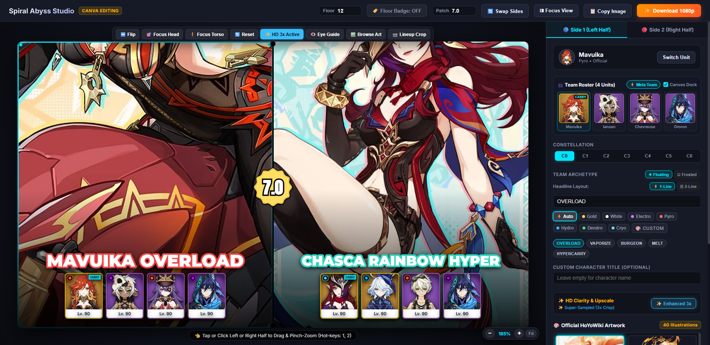

<div align="center">

# 🎬 Genshin Impact Spiral Abyss Studio

**The All-in-One Content Creation Suite for Spiral Abyss Creators**  
*1080p Thumbnail Studio • Automated CapCut PC Video Arranger • Smart BGM Engine • YouTube Chapter Generator*

[](https://github.com/nzubechukwudavid/genshin-abyss-studio/releases/latest)
[](https://github.com/nzubechukwudavid/genshin-abyss-studio/releases/latest)
[](LICENSE)
<br/>
[](https://python.org)
[](https://fastapi.tiangolo.com)
[](tests/)
[](https://www.capcut.com)
[](#1--1080p-visual-thumbnail-studio-100-offline-first)

<br/>

[✨ Key Features](#-key-features) • [🚀 Quick Start](#-quick-start) • [⚡ Architecture](#-system-architecture) • [⌨️ Shortcuts](#️-creator-ergonomics--shortcuts) • [📝 Changelog](CHANGELOG.md)

<br/>



</div>

---

### 🚀 Latest Highlights (v2.5.2)

- ⚡ **Streamlined 2-Pillar Creator Suite**: Focused the interface entirely on high-impact creator workflows: **Spotlight (1080p Visual Thumbnail Studio)** and **Arranger (Dynamic Video & Session Suite)**.
- 🎵 **Automated Zero-Touch CapCut Music Placement**: Retired the manual web BGM audition tab in favor of full algorithmic soundtrack matching, tempo alignment, and fadeouts placed directly onto CapCut Track 1.
- 🔊 **Calibrated Audio Levels (-20 dB Clips / -30 dB Music)**: Standardized gameplay audio at `-20.0 dB` while background music sits at `-30.0 dB`, letting character voicelines and combat hits cut through clearly.
- 🎬 **Dual-Team Showcase Auto-Editing**: Intelligently fuses two separate Abyss runs (Team A and Team B) into a unified showcase with smooth cross-chamber transitions.
- 🛡️ **Victory Screen Retention**: Locks in 1.8s–2.0s of the 3-star victory screen and combat completion moments at the end of each chamber.
- 🧪 **Zero Version Drift & 101 Passing Tests**: Automated single-source-of-truth version management across all backend, installer, frontend, and CI/CD artifacts with full regression coverage.
> 📖 **Full Changelog**: For the complete release history across all versions, see [**`CHANGELOG.md`**](CHANGELOG.md).

---

### 💡 Why Genshin Abyss Studio?
Producing high-retention Spiral Abyss showcase videos typically requires juggling 4 separate applications:
1. **Graphic design software** for split-screen 1080p thumbnails, character alignment, and lineup docks.
2. **Video editors** to manually scrub through recordings, cutting loading screens and dead air.
3. **Audio tools** to find battle music that matches exact chamber clear durations.
4. **Calculators & text editors** to manually compute chapter timecodes for YouTube descriptions.

**Genshin Abyss Studio eliminates the friction.** Built from the ground up as a native, 100% offline-first workstation, it automates the entire preparation and post-production workflow in seconds.

*Architected & crafted with ⚡ by [David (@nzubechukwudavid)](https://github.com/nzubechukwudavid).*

---

## ⚡ System Architecture

Instead of spending hours manually trimming clips, finding matching music, and layering graphics, the suite completes the entire pipeline in **under 15 seconds**:

```
[Raw Screen Recordings (Chambers 1-3 + Builds)]
                       │
                       ▼
 ┌───────────────────────────────────────────────┐
 │       Auto-Edit & Loading Screen Trimmer      │
 │  - Coarse-to-fine intermission detection      │
 │  - 7 clean cuts + cinematic transitions       │
 │  - -14 dB LUFS broadcast audio normalization  │
 └───────────────────────┬───────────────────────┘
                         │
        ┌────────────────┴────────────────┐
        ▼                                 ▼
┌───────────────────────────┐   ┌───────────────────────────┐
│   Smart BGM Recommender   │   │  1080p Thumbnail Studio   │
│ - Ultra-fast header scan  │   │ - 150+ character roster   │
│ - Zero duplicates across  │   │ - Official HoYoWiki art   │
│   Chambers 1-3 & Builds   │   │ - Direct canvas controls  │
│ - Synchronized in-app     │   │ - Golden eye alignment    │
│   video audition player   │   │ - 4-man showcase docks    │
└─────────────┬─────────────┘   └─────────────┬─────────────┘
              │                               │
              ▼                               ▼
 ┌───────────────────────────┐   ┌───────────────────────────┐
 │   Native CapCut PC Draft  │   │  YouTube Chapter Timestamps
 │ (Timeline + Audio Fades)  │   │ (Ready for YouTube Studio)│
 └───────────────────────────┘   └───────────────────────────┘
```

---

## ✨ Key Features

### 1. 🎨 1080p Visual Thumbnail Studio (100% Offline-First)
- **Direct Canvas Manipulation**: Interactive touch & mouse panning, pinch-to-zoom, and free framing directly on the 1080p canvas with live 60fps responsiveness.
- **100% Offline-First Architecture**: Over 150 official character avatars, typography fonts (Anton, Montserrat, Rubik, Inter), rosette medallions, and dividers are bundled directly in the application. No missing image icons or CDN network bottlenecks.
- **Complete 150+ Character Roster**: Full character catalog up to Natlan (*Mavuika, Citlali, Chasca, Kinich, Xilonen, Flins, Skirk, etc.*) with element filters and high-speed local avatar rendering.
- **Adaptive Patch Rosette Medallion**: Procedural metallic 16-lobed medallion shader that auto-adapts its gradient lighting to active character visions (Pyro, Hydro, Electro, Cryo, Anemo, Geo, Dendro, Gold) with custom hex color picker support.
- **4-Man Team Roster Docks & Screenshot Cropper**:
  - Donaturine / Sireula / Gust21 standard Level 90 Showcase cards with role badges.
  - Interactive In-Game Lineup Screenshot Cropper (`Ctrl + V` paste or file import) for instant in-game fidelity.
- **Official HoYoWiki Artwork Filmstrip**: 20–80+ high-resolution illustrations per unit (*announcements, birthday art, character cards, splash art*) with instant WebP thumbnail caching and 1-click 1800p HD portrait loader.
- **Cinematic Framing Tools**:
  - `🔄 Swap Sides`: Swap left and right characters instantly.
  - `👁️ Eye Guide`: Toggle golden alignment line for perfect cinematic framing.
  - `↔️ Flip`: Mirror character orientation.
  - `🎯 Focus Head` & `🧍 Focus Torso`: Instant framing presets.
- **Crisp 1080p PNG Export & Direct Clipboard**: Exports high-resolution 1920x1080 thumbnail without selection borders or guide lines, plus 1-click copy directly to system clipboard.

---

### 2. 🎬 Automated CapCut PC Video Editor
- **Dual-Team Showcase Pipeline**: Stitches Team A and Team B runs together into one unified 2-in-1 video showcase with clean cross-chamber matching.
- **Intelligent Loading Screen Removal**: Proprietary color difference scanner trims loading screens and dead air while preserving the full combat run.
- **Victory Screen & Chamber Cleared Retention**: Locks in 1.8s–2.0s of the 3-star victory screen and challenge completion animation before transitioning.
- **7-Cut Assembly**: Automatically stitches First Half, Second Half, and Character Builds into a ready-to-render 16:9 CapCut timeline.
- **Cinematic Transitions**: Smooth 0.5s `black_fade` or `woosh` blur zooms between chambers with transition overlap protection.
- **Native CapCut PC Draft Generator**: Writes native project drafts (`draft_content.json`) directly into your local CapCut drafts folder with zero re-encoding time.

---

### 3. 🎵 Smart Multi-Track BGM Engine
- **Ultra-Fast Recursive Indexing**: Scans 400–1,200 audio files per second using lightweight header parsing (`tinytag`) without decoding heavy audio waveforms.
- **Combat Duration & Energy Matcher**:
  - Matches high-energy battle music to Chambers 1, 2, and 3 clear times ($T_{C1}, T_{C2}, T_{C3}$).
  - Matches relaxed/lo-fi outro music to the Character Builds showcase (~1:30).
  - **Zero Duplicate Guarantee**: Enforces unique tracks across the entire run.
- **Calibrated Audio Mastering**: Automatically sets video clips to `-20.0 dB` and background music to `-30.0 dB`, letting character dialogue, hit sounds, and elemental bursts stand out clearly while music provides clean ambiance.
- **Zero-Touch CapCut Integration**: Automatically selects and places candidate tracks onto CapCut Track 1 with customized intro/outro fades during 1-Click assembly, eliminating all manual audio alignment.

---

### 4. ⏱️ Automatic YouTube Chapter Generator
- Computes microsecond-accurate timecodes for each chamber and team composition.
- Formats ready-to-paste description blocks for YouTube Studio:
  ```
  00:00 - Chamber 1-1 (Mavuika OVERLOAD)
  01:24 - Chamber 1-2 (Chasca LUNAR HEX)
  02:45 - Chamber 2-1 (Mavuika OVERLOAD)
  04:02 - Chamber 2-2 (Chasca LUNAR HEX)
  05:30 - Character Builds, Weapons & Artifacts
  ```
- Automatically syncs metadata between local desktop and web studio.

---

## ⌨️ Creator Ergonomics & Shortcuts

| Shortcut | Action | Description |
| :--- | :--- | :--- |
| `Ctrl + Z` | Undo | Reverts the last canvas transform, preset, or roster change (up to 40 steps) |
| `Ctrl + Y` / `Ctrl + Shift + Z` | Redo | Restores the previously undone canvas action |
| `Ctrl + S` | Save Project | Instantly exports self-contained `.abyss` project file with all current canvas state |
| `Ctrl + O` | Open Project | Prompts file picker to load an existing `.abyss` project workspace |
| `1` | Select Side 1 (Left) | Activates left character slot for transform & styling |
| `2` | Select Side 2 (Right) | Activates right character slot for transform & styling |
| `S` | Swap Sides | Seamlessly swaps left and right characters and team rosters |
| `F` | Mirror / Flip | Horizontally flips the active character portrait |
| `G` | Toggle Eye Guide | Displays the golden eye-level alignment crosshair |
| `E` | HD Clarity Boost | Triggers bilateral super-resolution edge restoration |
| `Ctrl + V` | Paste Screenshot | Opens the in-game lineup crop modal from clipboard |
| `Esc` | Clear / Close | Clears search input or closes active modal |

---

## 🚀 Quick Start

### 🌟 Option 1: Single-File Setup Installer (Recommended)
**Best for all creators.** No Python, terminal, or Git required!
1. Download **[`GenshinAbyssStudio-Setup.exe`](https://github.com/nzubechukwudavid/genshin-abyss-studio/releases/latest)** from the latest GitHub Release.
2. Run the installer wizard. It will install the application and create Desktop and Start Menu shortcuts.
3. Launch **Genshin Abyss Studio** and start creating!

### 📦 Option 2: Portable ZIP Package
1. Download **[`GenshinAbyssStudio-Windows-x64.zip`](https://github.com/nzubechukwudavid/genshin-abyss-studio/releases/latest)**.
2. Extract the ZIP anywhere on your PC.
3. Double-click **`GenshinAbyssStudio.exe`** (or `Launch Genshin Abyss Studio.bat`).
4. The studio opens instantly in an isolated desktop window.

### 🐍 Option 3: Run from Source (Python 3.10+)

#### 1. Clone & Install
```bash
git clone https://github.com/nzubechukwudavid/genshin-abyss-studio.git
cd genshin-abyss-studio
pip install -r requirements.txt
```

#### 2. Launching the Suite
- **Web Browser Studio**:
  ```bash
  python app.py
  ```
  Open **`http://localhost:7860`** in any browser.

- **Dedicated Desktop Studio**:
  ```bash
  python execution/desktop_main.py
  ```

- **Standalone Video Auto-Editor**:
  ```bash
  python execution/abyss_editor_gui.pyw
  ```

---

## 💻 Command-Line Automation

For advanced users and automated rendering pipelines:

```bash
# Index a local audio folder
python execution/music_indexer.py --scan "C:\Path\To\Music" --rescan

# Get BGM recommendations for specific chamber durations (in seconds)
python execution/music_recommender.py --durations 85.0 112.0 96.0 --builds 90.0

# Run automated CapCut assembly from screen recordings
python execution/auto_edit_abyss.py --input-dir "C:\Path\To\Recordings" --transition black_fade --open-capcut
```

---

## 🖥️ System Requirements

| Component | Minimum | Recommended |
|:---|:---|:---|
| **Operating System** | Windows 10 (64-bit) | Windows 10 / 11 (64-bit) |
| **Processor** | Dual-core 2.0 GHz | Quad-core 3.0 GHz or higher |
| **RAM** | 4 GB | 8 GB or more |
| **Display Resolution** | 1366 × 768 | 1920 × 1080 (Full HD) |
| **Video Editor** | CapCut PC (optional, for video auto-assembly) | CapCut PC latest version |

---

## ⚠️ Known Limitations & Operational Constraints

- **Platform-Specific Video Auto-Assembly**: Automated CapCut PC draft creation and timeline synthesis require a 64-bit Windows environment with CapCut PC installed.
- **Cloud Sandbox Deployments**: Cloud-hosted instances (e.g. Linux container sandboxes) cannot access local recordings folders on a creator's machine or launch desktop GUI binaries; thumbnail design, official HoYoWiki asset caching, and chapter metadata formatting remain fully operational in cloud mode.
- **Video Cut Detection & Ambient Lighting**: Dynamic loading screen detection relies on multi-signal luminance analysis and motion pixel variance. Unconventional camera transitions, heavy elemental particle bursts, or custom brightness mods can be manually adjusted via the Creator Timeline Trim Overrides.
- **Offline-First Asset Caching**: Official HoYoWiki character art and game assets require network connectivity on first access to populate the local disk cache; once downloaded, all thumbnail composition and export workflows operate 100% offline.
- **Hardware Performance**: Video analysis throughput scales with CPU capabilities, SSD read speeds, and source codecs (typically 10–15 seconds for a standard 4-clip Abyss Floor 12 recording on modern NVMe drives).

---

## 🛠️ Tech Stack

- **Backend Runtime**: Python 3.11, FastAPI, Uvicorn, Starlette
- **Computer Vision & Media**: OpenCV (`cv2`), Pillow (`PIL`), TinyTag
- **Frontend Architecture**: Vanilla HTML5, High-Performance Canvas API, Glassmorphic CSS3
- **Media Streaming**: RFC 7233 Range Streaming with exponential audio fade curves
- **Packaging**: PyInstaller, Inno Setup Compiler

---

## 👨‍💻 Author & Acknowledgments

**Genshin Abyss Studio** is architected and maintained by **[David (@nzubechukwudavid)](https://github.com/nzubechukwudavid)**.

- 🐛 **Report a Bug / Request a Feature**: [GitHub Issues](https://github.com/nzubechukwudavid/genshin-abyss-studio/issues)
- 🌟 **Star the Project**: If this tool streamlines your workflow, consider giving it a star on GitHub!
- 🤝 **Contributions**: Community pull requests, discussions, and feature suggestions are welcome.

---

## ⚖️ Legal & Community Fair-Use Disclaimer

This software is an independent, non-commercial fan-made project developed in accordance with HoYoverse's Overseas Fan-Made Content Policy.

- **Genshin Impact™**, characters, visual assets, game audio, and trademarks are the intellectual property and copyright of **COGNOSPHERE PTE. LTD. / miHoYo**.
- This suite is provided free of charge for community content creators under the **MIT License**.

---

## 📄 License
Released under the [MIT License](LICENSE) • Copyright © 2026 David.
