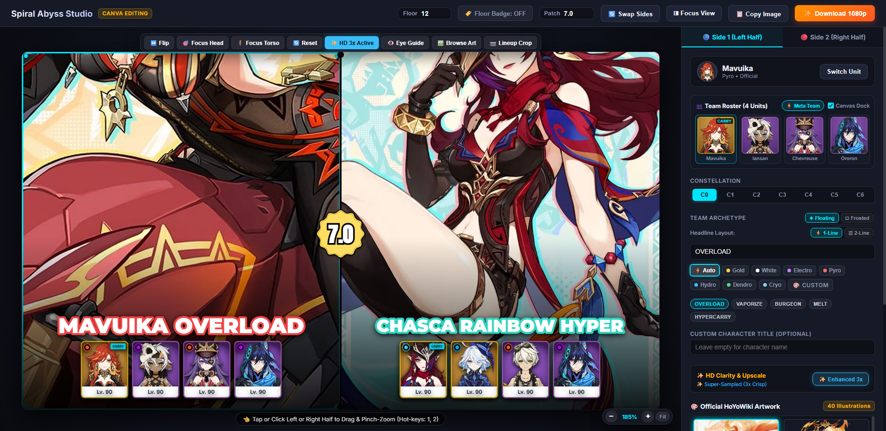

<div align="center">

# 🎬 Genshin Impact Spiral Abyss Studio

**The All-in-One Content Creation Suite for Spiral Abyss Creators**  
*1080p Thumbnail Studio • Automated CapCut PC Video Arranger • Smart BGM Engine • YouTube Chapter Generator*

[](https://github.com/nzubechukwudavid/genshin-abyss-studio/releases/latest)
[](https://github.com/nzubechukwudavid/genshin-abyss-studio/releases/latest)
[](LICENSE)
<br/>
[](https://github.com/nzubechukwudavid/genshin-abyss-studio/actions/workflows/release.yml)
[](https://python.org)
[](https://www.capcut.com)

<br/>

[✨ Features](#-features) • [🚀 Quick Start](#-quick-start) • [⌨️ Shortcuts](#️-shortcuts) • [📝 Changelog](CHANGELOG.md)

<br/>



</div>

---

## What Is It?

Producing a high-quality Spiral Abyss showcase video normally means juggling four separate tools — a graphic design app for thumbnails, a video editor for trimming clips, an audio tool for finding matching music, and a text editor for computing YouTube timestamps.

**Genshin Abyss Studio replaces all of them.** It's a single, offline-first Windows desktop suite that takes your raw Abyss recordings and handles the entire post-production workflow — trimming, music matching, thumbnail design, and YouTube metadata — in one place.

*Built and maintained by [David (@nzubechukwudavid)](https://github.com/nzubechukwudavid).*

---

## 🚀 Latest Highlights (v3.0.0)

- ⚙️ **In-App Settings Hub**: Configure your recordings folder, music library, and render output paths directly inside the studio — no config files, no restarts.
- ⚔️ **Stygian Onslaught Mode**: Full support for the new 3-boss Stygian content — switch instantly between Stygian and classic Floor 12 Spire layouts without any freezes.
- 🎬 **Smoother CapCut Timeline Generation**: Fixed character slots getting stuck on "Loading…" during CapCut assembly. Drafts generate reliably, first time every time.
- 🎵 **Audio Level Controls in Settings**: Tune your gameplay and BGM volume balance from inside the app — applied automatically to every CapCut draft you generate.
- 📄 **Live System Info Panel**: The About tab now shows your live runtime status — Python version, OS, FFmpeg availability, and desktop/cloud mode at a glance.

---

## ✨ Features

### 🎨 1080p Thumbnail Studio
Design professional split-screen Spiral Abyss thumbnails without leaving the app.

- 150+ character roster up to Natlan (Mavuika, Citlali, Chasca, Kinich, Xilonen, Skirk, and more) with element filters
- Official HoYoWiki artwork filmstrip with 1-click HD portrait loading and offline caching
- Interactive canvas — pan, pinch-zoom, and frame characters with a golden eye-level alignment guide
- 4-man team roster docks, 36★ clear badges, channel watermarks, and draggable text stamps (C0, SOLO, F12, etc.)
- A/B thumbnail audition — compare two variants side-by-side in a simulated YouTube browse feed
- Export as lossless 1080p PNG, YouTube-optimised JPEG (<2MB), or transparent roster strip for OBS

### 🎬 Automated CapCut PC Video Arranger
Turn raw recordings into a ready-to-render CapCut timeline in seconds.

- Automatically detects and trims loading screens and dead air from each chamber recording
- Preserves the 3-star victory screen at the end of each chamber before transitioning
- Supports single runs (4 clips), dual showcase runs (8 clips), and Stygian Onslaught (3 boss clips + builds)
- Generates a native CapCut PC draft — open CapCut and your timeline is already assembled with transitions

### 🎵 Smart BGM Engine
Automatically matches background music to each chamber without manual searching.

- Scans your local music library and picks tracks that match each chamber's combat duration
- Guarantees no duplicate tracks across chambers or the builds showcase
- Places selected tracks directly onto CapCut Track 1 with intro/outro fades — no manual placement needed

### ⏱️ YouTube Chapter Generator
Instantly produces ready-to-paste chapter timestamps for YouTube Studio.

```
00:00 - Chamber 1-1 (Mavuika OVERLOAD)
01:24 - Chamber 1-2 (Chasca LUNAR HEX)
02:45 - Chamber 2-1 (Mavuika OVERLOAD)
04:02 - Chamber 2-2 (Chasca LUNAR HEX)
05:30 - Character Builds, Weapons & Artifacts
```

---

## ⌨️ Shortcuts

| Shortcut | Action |
| :--- | :--- |
| `Ctrl + Z` / `Ctrl + Y` | Undo / Redo (up to 40 steps) |
| `Ctrl + S` / `Ctrl + O` | Save / Open `.abyss` project file |
| `1` / `2` | Select Side 1 / Side 2 character slot |
| `S` | Swap left and right characters |
| `F` | Flip / mirror active character |
| `G` | Toggle golden eye-level alignment guide |
| `Alt + D` | Duplicate Side 1 team to Side 2 |
| `Ctrl + V` | Paste in-game lineup screenshot |
| `Esc` | Close active modal or clear search |

---

## 🚀 Quick Start

### 🌟 Option 1: Installer (Recommended)
No Python or terminal required.

1. Download **[`GenshinAbyssStudio-Setup.exe`](https://github.com/nzubechukwudavid/genshin-abyss-studio/releases/latest)** from the latest release.
2. Run the installer — it creates Desktop and Start Menu shortcuts automatically.
3. Launch **Genshin Abyss Studio** and start creating.

### 📦 Option 2: Portable ZIP
1. Download **[`GenshinAbyssStudio-Windows-x64.zip`](https://github.com/nzubechukwudavid/genshin-abyss-studio/releases/latest)**.
2. Extract anywhere and double-click **`GenshinAbyssStudio.exe`**.

### 🐍 Option 3: Run from Source (Python 3.10+)
```bash
git clone https://github.com/nzubechukwudavid/genshin-abyss-studio.git
cd genshin-abyss-studio
pip install -r requirements.txt
python app.py
```
Then open **`http://localhost:7860`** in your browser.

---

## 🖥️ System Requirements

| | Minimum | Recommended |
|:---|:---|:---|
| **OS** | Windows 10 (64-bit) | Windows 10 / 11 (64-bit) |
| **CPU** | Dual-core 2.0 GHz | Quad-core 3.0 GHz+ |
| **RAM** | 4 GB | 8 GB |
| **Display** | 1366 × 768 | 1920 × 1080 |
| **CapCut PC** | Optional (for video assembly) | Latest version |

---

## 📝 Notes

- **Video auto-assembly requires CapCut PC** installed on Windows. Thumbnail design and YouTube chapter generation work without it.
- **Character art is cached locally** on first use — subsequent sessions are fully offline.
- **Loading screen detection** is based on luminance analysis. Unusual brightness mods or camera transitions can be corrected with the manual trim override.

---

## 👨‍💻 Author

**Genshin Abyss Studio** is built and maintained by **[David (@nzubechukwudavid)](https://github.com/nzubechukwudavid)**.

- 🐛 [Report a bug or request a feature](https://github.com/nzubechukwudavid/genshin-abyss-studio/issues)
- 🌟 If this saves you time, a star on GitHub goes a long way!

---

## ⚖️ Legal

This is an independent, non-commercial fan project made in accordance with HoYoverse's Overseas Fan-Made Content Policy. **Genshin Impact™** and all associated characters and assets are the intellectual property of **COGNOSPHERE PTE. LTD. / miHoYo**.

Released under the [MIT License](LICENSE) • Copyright © 2026 David.
